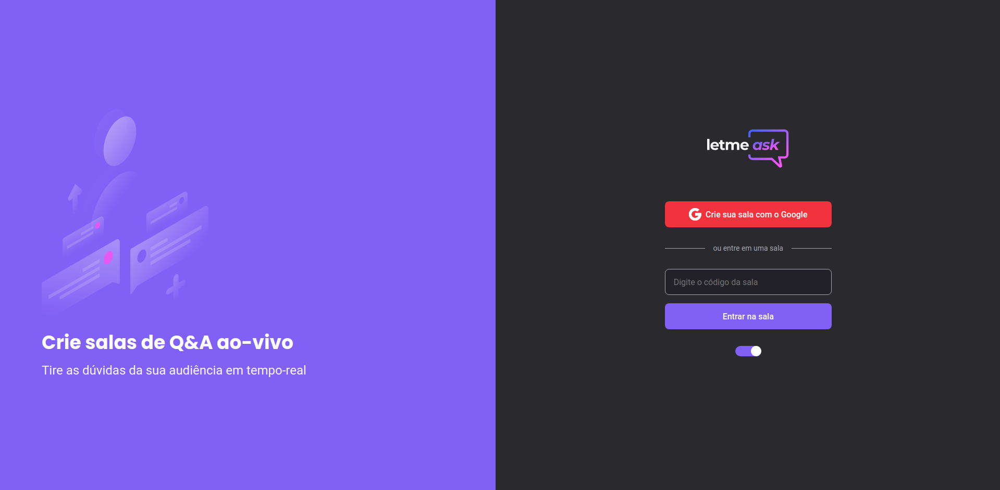
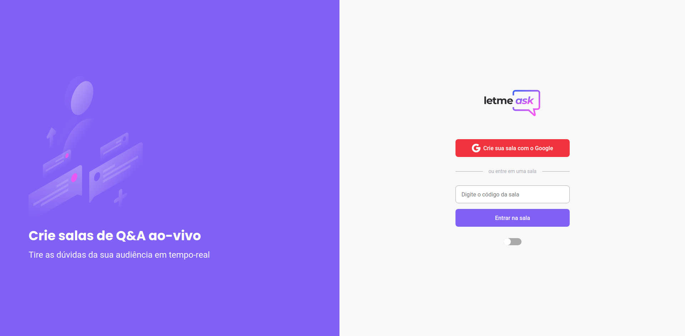
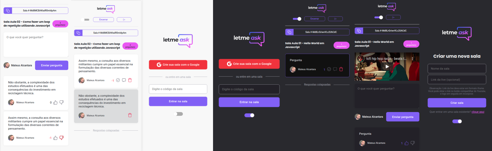
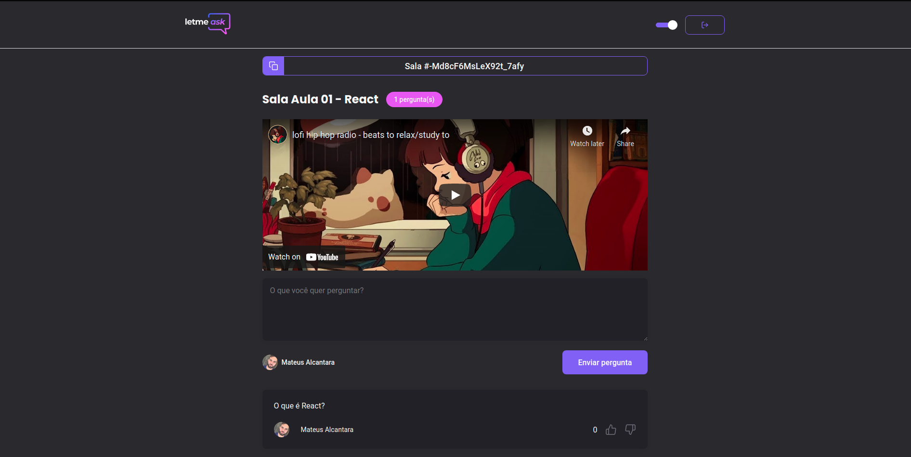
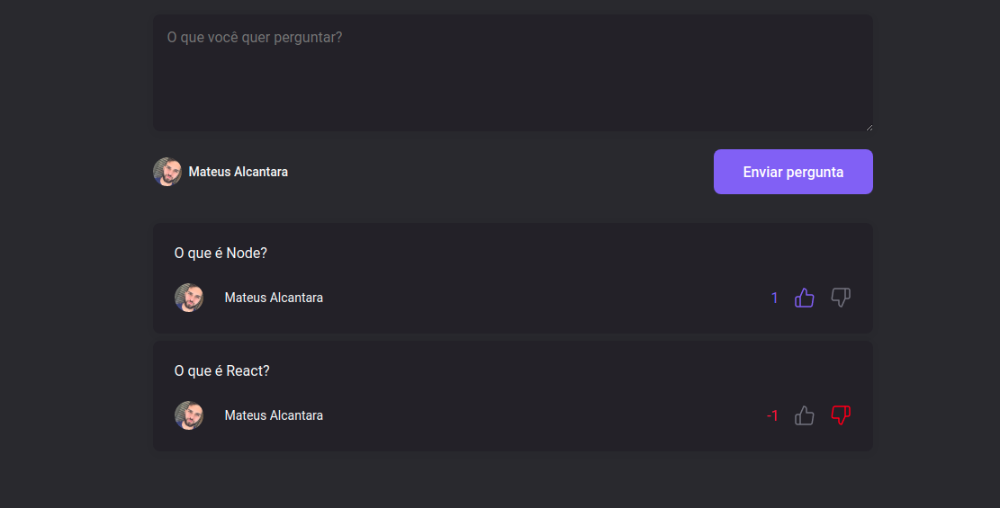
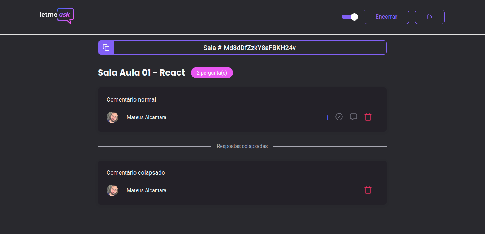
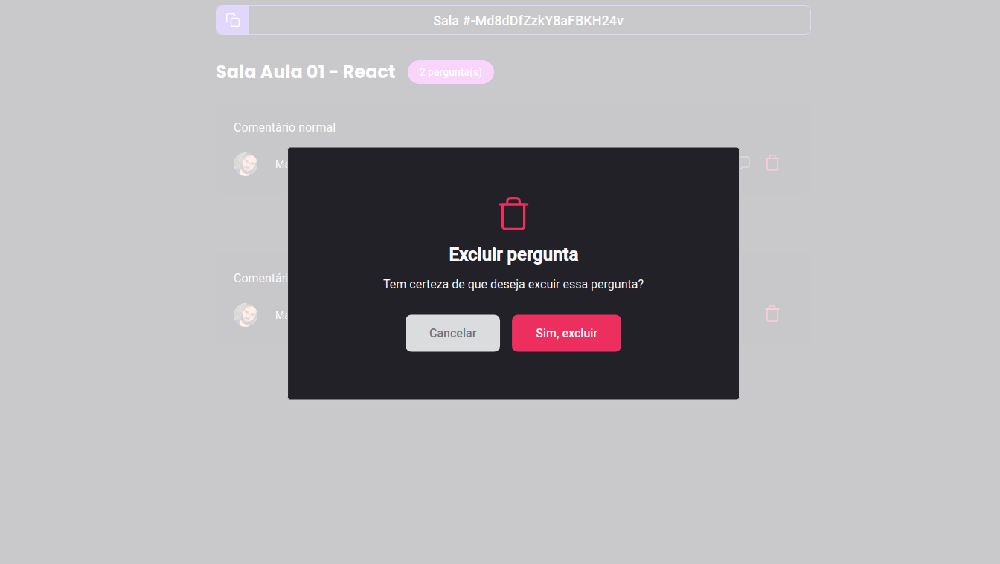

# Let me Ask





Let me Ask is an App developed in Next Level Week Bootcamp by Rocketseat.

# Build With

- Typescript
- Styled Components
- Firebase
- Eslint + Prettier
- React Hot Toast
- React Switch
- React Modal

# Features

- Create a Q&A room with your Gmail account
- Your students can ask you questions about class
- You can highligh questions that you are answering
- You can remove questions as Admin
- You can mark a question as "answered'
- Your students can upvote relevant questions

# Aditional Features That I Made After Bootcamp

### ESLint + Prettier

I added a linting config with eslint and prettier to have a standard in the application

### Styled Components

I changes all styling system to use Styled Components. This made easy to me to custom the app and allowed me to customize themes.

### Dark Mode

I added a dark mode to users who don't like light themes. To build this feature I used react-switch and themes inside styled-components, creating a context to handle with transition and saving its state in localhost.

### Responsive website

I made all the website responsive using styled components with media queries.

### Youtube integration

Before this feature, users needed to have 2 tabs opened to watch class and ask questions about it. Now if the admin of the page provide a url to the live, it'll be embed above the question textarea. It makes all information be in a single tab.



### Dislike System

I added a dislike system to prevent web trolls. Trolls are a big problem and can screw up a good leasson, so, students can downvote questions that they didn't liked. To build this feature, I used a new field in database to handle dislikes.



### Sort questions by likes

Questions are now sorted by likes. It helps students and the admin of the room to find the better questions fast and know what is relevant to the community.

### Collapse questions with a lot of dislikes

There are questions that aren't relevant to still be showed to students. After a pre determined number os dislikes, a question is collapsed. It disappear to students and appear in another list to admins, in the end of the questions.



### Answered questions to the end

Answered questions are now sorted in a way that they are always on bottom of the list. It maintain the screen clean to students and to the admin of the room.

### Log out button

The lack of a log out button is annoying to some users.

### Modal to remove questions

I added a modal to confirm questions deletion. It made the project more professional.



### Admins now can remove highlighted questions

It was a problem with the previous version of the App. If an admin highlighted a question, it couldn't be unhighlited. Now admins can do it.

### Toasts

I added a toast when the user try to enter in a room closed or use a wrong room code.

# Installation

You'll need NPM to install this application.

Open your bash and run:

```bash
git clone https://github.com/mat-alcantara/let-me-ask.git let-me-ask
```

```bash
cd let-me-ask
```

```bash
npm run install
```

## Usage

I let my Firebase Credentials on .env.local available in github, but you can change it. You just need to use a realtime database with these rules:

```
{
  "rules": {
    "rooms": {
      ".read": false,
      ".write": "auth != null",
      "$roomId": {
        ".read": true,
        ".write": "auth != null && (!data.exists() || data.child('authorId').val() == auth.id)",
        "questions": {
          ".read": true,
          ".write": "auth != null && (!data.exists() || data.parent().child('authorId').val() == auth.id)",
          "likes": {
            ".read": true,
            ".write": "auth != null && (!data.exists() || data.child('authorId').val() == auth.id)"
          },
          "deslikes": {
            ".read": true,
            ".write": "auth != null && (!data.exists() || data.child('authorId').val() == auth.id)"
          }
        }
      }
    }
  }
}
```

Please change REACT_APP_LIMIT_TO_COLLAPSE in .env too. It is the maximum dislikes a question can receive before collapse and disappear.

After this, just run:

```bash
npm run start
```

## Contributing

Pull requests are welcome. For major changes, please open an issue first to discuss what you would like to change.

Please make sure to update tests as appropriate.

## License

[MIT](https://choosealicense.com/licenses/mit/)

https://www.youtube.com/watch?v=5qap5aO4i9A&ab_channel=LofiGirl
https://youtu.be/5qap5aO4i9A

<iframe width="560" height="315" src="https://www.youtube.com/watch?v=5qap5aO4i9A&ab_channel=LofiGirl" title="YouTube video player" frameborder="0" allow="accelerometer; autoplay; clipboard-write; encrypted-media; gyroscope; picture-in-picture" allowfullscreen></iframe>
